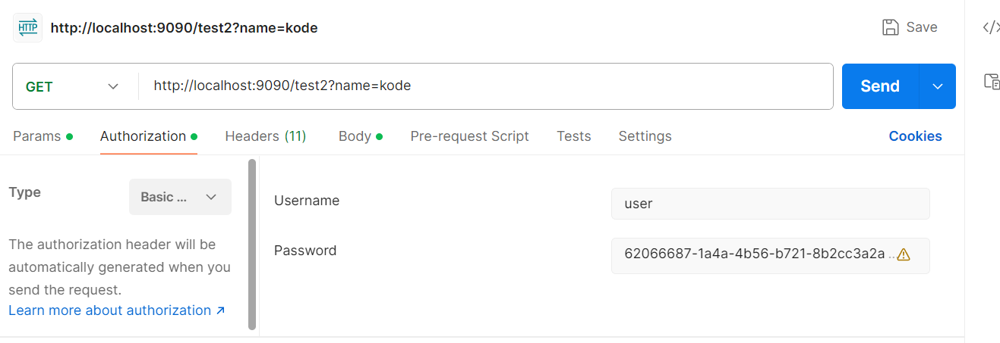
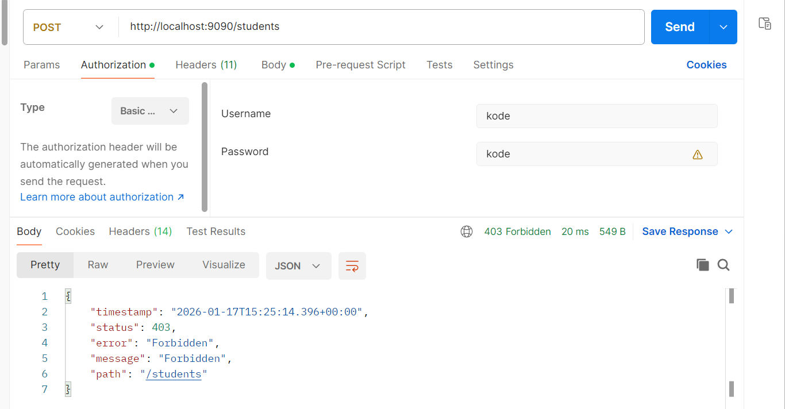
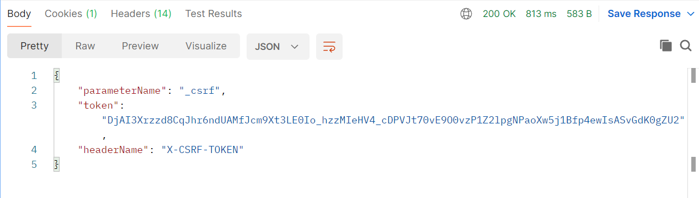

# Spring Boot Security Basics (Authentication + Authorization)

- Spring Security is used to protect APIs.

1. What is Authentication?
   - ✅ Who are you?
   - Example:
       login with username/password
       OTP
       token
2. What is Authorization?
   - What can you do?
   - Example:
     - USER can view profile
     - ADMIN can delete users

steps: 
1. add dependency
    - `<dependency>
       <groupId>org.springframework.boot</groupId>
       <artifactId>spring-boot-starter-security</artifactId>
       </dependency>`
    - By default:
      - All endpoints become secured
      - You must login to access APIs
      - Default login form is enabled
2. default username: userEntity
   - password in console
   - 

3. _Disable security_
    - `@Configuration
      public class SecurityConfig {
      @Bean
      public SecurityFilterChain securityFilterChain(HttpSecurity http) throws Exception {
           http
               .csrf(csrf -> csrf.disable())
               .authorizeHttpRequests(auth -> auth.anyRequest().permitAll());
           return http.build();
      }
      }`

4. custom password
    - `@Bean
      public InMemoryUserDetailsManager userdetails(){
      UserDetails userDetails = User.withUsername("kode").roles("USER").password("{noop}kode").build();
      return new InMemoryUserDetailsManager(userDetails);
      }`
    - 0r
    - `spring.security.userEntity.name=vivek
      spring.security.userEntity.password=1234`

5. want to have few api public and few private
    -  `@Bean
       public SecurityFilterChain securityFilterChain(HttpSecurity security) throws Exception {
       security.csrf(csrf -> csrf.disable())
       .authorizeHttpRequests(auth ->
       auth.requestMatchers("/test*").permitAll()   // PERMIT only /test*
       .anyRequest().authenticated())               // remaining need password
       .httpBasic(httpbasic -> {});                 // basic authentication
       return security.build();
       }`

6. Authorization
    - `@Bean
      public SecurityFilterChain securityFilterChain(HttpSecurity http) throws Exception {
      http
      .csrf(csrf -> csrf.disable())
      .authorizeHttpRequests(auth -> auth
      .requestMatchers("/public").permitAll()
      .requestMatchers("/userEntity/**").hasRole("USER")
      .requestMatchers("/admin/**").hasRole("ADMIN")
      .requestMatchers("/common/**").hasAnyRole("USER", "ADMIN")
      .anyRequest().authenticated()
      )
      .httpBasic(httpBasic -> {});
      return http.build();
      }`
    - `@Bean
       public InMemoryUserDetailsManager userDetailsService() {
        UserDetails userEntity = User.withUsername("vivek")
                .password("{noop}1234")
                .roles("USER")
                .build();
        UserDetails admin = User.withUsername("admin")
                .password("{noop}admin123")
                .roles("ADMIN")
                .build();
        return new InMemoryUserDetailsManager(userEntity, admin);   }`

## csrf token  - cross site request forgery

issue: 
  - when i open bank.com website **browser** has my session details cookies
  - so at same time if some attacker adds some ads or some way make you to open his website in same browser
     bad.com and ask to submit or click anything but in backend he makes calls to bank.com
  - since you are on same browser and cookies still present bank.com doesn't ask for credentials again
  - if you delete cookies then there wont be any problem

- for get operation works fine
- for post,update and delete (where data changes will not work)
- 
-  i have username and password correct but still not working for post operation
  - i need csrf token in postman headers 

- If your app is using Session login (JSESSIONID) and CSRF is enabled (default behaviour:
- GET works without CSRF
- POST/PUT/DELETE fails unless you send CSRF token

## 1 way

How to get csrf
- `@GetMapping("csrf")
  public CsrfToken getcsrf(HttpServletRequest request){
  return (CsrfToken) request.getAttribute("_csrf");
  }`
-
-  token will work till session expires

* “CSRF happens because session cookies are automatically attached by the browser to requests for the target domain.
An attacker cannot access the session cookie value, but can still trigger a request from the victim’s browser, and the browser will include the session cookie.
CSRF tokens prevent this because the attacker cannot generate or read the token due to same-origin policy.”

## 2 nd way

   - #### server.servlet.session.cookie.same-site=strict
   - cross site doesn't have access to cookies
   - “To restrict session cookies to be used only within the same website, we set the cookie attribute SameSite (preferably SameSite=Strict or SameSite=Lax).
     This prevents the browser from sending the session cookie (like JSESSIONID) in cross-site requests, which greatly reduces CSRF risk.
     Additionally, we use Secure and HttpOnly flags to protect the cookie over HTTPS and block JavaScript access.” 

## 3r wat

  - state vs stateless Session
  - ✅ State vs Stateless (Session)
    
    - ✅ **1) Stateful** (Session-based authentication)
      - Server stores userEntity state (login info) in memory/DB (session store)
      - Client only sends session id cookie (JSESSIONID)

      - Flow
        - Login success → server creates session
        - Browser stores cookie: JSESSIONID=xyz
        - Every request → browser sends cookie automatically
        - Server checks session → allows request
        
      - ✅ Pros
        - Simple to implement
        - Easy logout (invalidate session)
        - Good for traditional web apps

      - ❌ Cons
        - Needs server memory/storage for sessions
        - Harder to scale (multi-node needs sticky session / Redis)
        - Cookie auto-sent → CSRF risk exists

    - ✅ **2) Stateless** (Token-based authentication)
      - Server does not store session state
      - Client sends token (usually JWT) in **header every time**

      - Flow
        - Login success → server returns token (JWT)
        - Client stores token (frontend)
        - Every request sends:
        - Authorization: Bearer <token>
        - Server validates token signature + expiry → allows request

      - ✅ Pros
        - Scales easily (no server session store)
        - Works well for microservices
        - No sticky sessions needed

      - ❌ Cons
        - Logout is not immediate unless you maintain blacklist/refresh-token revoke
        - If token leaked → attacker can use it until expiry
        - Token rotation/refresh logic needed for better security

# so in stateless
 - Token is sent manually using header
 - Browser does NOT automatically attach session details cross-site requests.

Interview Summary (2 lines)

✅ Stateful apps use server-side session + cookies → cookies auto-sent → CSRF required.
✅ Stateless apps use JWT in Authorization header → not auto-sent → CSRF usually not required.

## sessionless configuration

- `@Bean
  public SecurityFilterChain securityFilterChain(HttpSecurity security) throws Exception {
        security.csrf(csrf -> csrf.disable())
                .authorizeHttpRequests(auth ->
                          auth.requestMatchers("/test").hasRole("TEST")
                                  .requestMatchers("/customExp").hasRole("EXP")
                                  .requestMatchers("/info").hasAnyRole("TEST","EXP")
                                  .anyRequest().authenticated())
                .httpBasic(Customizer.withDefaults())
                .sessionManagement(session -> session.sessionCreationPolicy(SessionCreationPolicy.STATELESS));
        return security.build();
  }`
