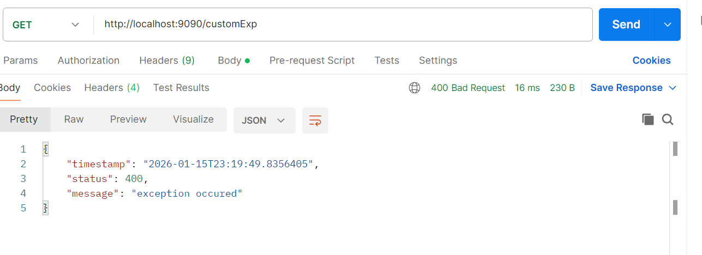

# Why Spring Boot Came into Picture? (VERY IMPORTANT)

## Problems with traditional Spring 😵

* Too much XML / Java config
* Manual dependency management
* External Tomcat setup
* Boilerplate code
* Steep learning curve

## Spring Boot Solution ✅

* Spring Boot = Spring + Opinionated Defaults + Auto Configuration
* Spring Boot is NOT a replacement for Spring
  - It is Spring framework + features to reduce configuration + easy production-ready setup.

* @SpringBootApplication
  * **@SpringBootConfiguration**
  * **@EnableAutoConfiguration**
    * It enables Spring Boot to load configurations from:
      * spring.factories (older)
      * AutoConfiguration.imports (newer approach)
  * **@ComponentScan**

## 2️⃣ What EXACTLY is Spring Boot?

📌 Interview definition:

* Spring Boot is an extension of Spring that simplifies application development 
   by providing auto-configuration, starter dependencies, and embedded servers.

## 3️⃣ Core Pillars of Spring Boot (Must Remember)

1. Auto Configuration
    * Spring Boot:
    * Looks at classpath
    * Looks at application.properties
    * Automatically configures beans

* What does Classpath mean?
    - Simple definition:
      - Classpath = all the classes and libraries available to your application at runtime
    - It includes:
      - Your compiled classes (target/classes)
      - JARs added via Maven/Gradle dependencies
      - JDK classes
📌 If a class is present in classpath, Java (and Spring Boot) can see and use it.

* Real-life analogy 🧠
  * Think of classpath like a toolbox 🧰
  * If a tool is inside the toolbox, you can use it
  * If it’s not inside, you can’t
  * Spring Boot opens the toolbox and asks:

“Which tools (libraries) are present?”
  * Example: spring-boot-starter-web

When you add:
`<dependency>
  <groupId>org.springframework.boot</groupId>
  <artifactId>spring-boot-starter-web</artifactId>
</dependency>`

- This adds to classpath:
    * DispatcherServlet
    * @RestController
    * Tomcat
    * Jackson (ObjectMapper)

- Now Spring Boot detects:
    * “Ah! Web classes are present”
    * It auto-configures:
      * Embedded Tomcat
      * DispatcherServlet
      * JSON converter
      
- How Spring Boot checks the classpath?
  - Internally, it uses:
  - @ConditionalOnClass(SomeClass.class)
Example:

`@ConditionalOnClass(DispatcherServlet.class)
public class WebMvcAutoConfiguration {
}`
📌 Meaning:
- “Configure Spring MVC ONLY IF DispatcherServlet is present in classpath”

- Concrete Example (Most Asked)
  - Case 1️⃣: Web dependency present
  - spring-boot-starter-web

Classpath contains:
✔ DispatcherServlet
✔ Tomcat

Result:
✔ Web app
✔ REST APIs enabled

Case 2️⃣: Web dependency NOT present
spring-boot-starter

Classpath contains:
❌ DispatcherServlet

Result:
❌ No Tomcat
❌ No controllers
✔ Simple Java application

- Another Example: Database Auto Configuration
If this class is present:
javax.sql.DataSource
Spring Boot says:
- “Database-related classes exist”
Then it checks:
- spring.datasource.url
- spring.datasource.username

➡️ Auto-creates DataSource bean

❌ If DB driver not in classpath → no DataSource

# Why this is powerful 🚀

Without Spring Boot ❌:
- You manually configure everything
With Spring Boot ✅:
- Dependencies decide behavior
- Minimal config
- Less code
- Fewer bugs

## Interview-ready one-liner 🎯
 * Spring Boot inspects the classpath to detect available libraries and automatically configures beans using conditional annotations like @ConditionalOnClass.

2. Starter Dependencies

- Instead of 10 dependencies ❌
- You add 1 starter ✅

`<dependency>
  <groupId>org.springframework.boot</groupId>
  <artifactId>spring-boot-starter-web</artifactId>
</dependency>`

Includes:
* Spring MVC
* Jackson
* Validation
* Embedded Tomcat
* Logging

- Convention over Configuration

### **4. Embedded Server**

- No external Tomcat needed ❌
java -jar app.jar
✔ Tomcat (default)
✔ Jetty / Undertow (optional)
- By default for web:
- Tomcat embedded comes from spring-boot-starter-web

## Entry Point – @SpringBootApplication

`@SpringBootApplication
public class MyApp {
public static void main(String[] args) {
SpringApplication.run(MyApp.class, args);
}
}`

#### What it actually contains 👇

- @SpringBootConfiguration
- @EnableAutoConfiguration
- @ComponentScan

### Profiles (VERY COMMON)
- spring.profiles.active=dev

Files: application.properties < application-{profile}.properties
- application-dev.properties
- application-prod.properties

Use case:
* DB config
* Logging
* Feature toggles

8️⃣ Dependency Injection – Same as Spring
Nothing new here ✔
Your Spring knowledge applies 100%

## application.properties / application.yml (Core Spring Boot Config)

- Spring Boot reads config mainly from **application.properties**
  - server.port=9090
  - server.servlet.context-path=/api
  - logging.level.root=INFO
    logging.level.org.springframework=INFO
    logging.level.com.vivek=DEBUG
  - debug=true    (It prints which AutoConfigurations matched / not matched.)
  - app.name=spring-boot-demo    (custom propertiesx)
    app.owner=vivek

## Profiles (dev/test/prod)

- Profiles mean: different configs for different environments.
  - ✅ application.properties (common)
    ✅ application-dev.properties
    ✅ application-prod.properties
  - application-dev.properties overrides application.properties

## Spring Boot REST API Basics (Most Important)

- Spring Boot REST API = Expose HTTP endpoints like:
  - GET → fetch data
  - POST → create data
  - PUT → update
  - DELETE → delete

- **@RestController** = @Controller + @ResponseBody
  - it returns JSON/Text directly, not a JSP/HTML page.

- **@PathVariable**
  - When URL contains dynamic value.
  - GET http://localhost:8080/users/10
  - ` @GetMapping("/users/{id}")
     public String getUser(@PathVariable int id) {
     return "User id = " + id;
     }`

- **@RequestParam**
  - When value comes as query param.
  - GET /search?name=vivek&city=hyd
  -  `@GetMapping("/search")
     public String search(@RequestParam String name,
     @RequestParam String city) {
     return "Searching name=" + name + ", city=" + city;
     }`

- **@RequestBody**
  - When client sends JSON body.
  - `@PostMapping
    public Employee createEmployee(@RequestBody Employee emp) {
    return emp; // echo back
    }`

- **ResponseEntity**
  - return _body + HTTP_ status code
  -  `@GetMapping("/ok")
     public ResponseEntity<String> ok() {
     return ResponseEntity.ok("Success");
     }

     @GetMapping("/created")
     public ResponseEntity<String> created() {
     return ResponseEntity.status(201).body("Created");
     }`

- sterotype annotation
  - All stereotype annotations are special types of @Component, meaning:
    - Spring will detect them in component scan
    - Spring will create a Bean and manage it
  1. @Component
      - No specific layer (utility/helper/config classes)
      - Just marks class as a Spring bean
  2. @Service
      - uses - Business logic / rules / calculations
      - Mainly for readability + layer separation
      - No extra feature by default
  3. @Repository
      - DB related logic (DAO / repository classes)
      - Exception Translation
        - Spring converts DB exceptions into Spring exceptions
  4. @Controller (Web MVC Controller)
      - Making MVC apps (HTML pages)
      - Returns View (HTML/JSP/Thymeleaf) usually
  5. @RestController ✅ (REST API Controller)
      - Creating REST APIs returning JSON/XML
      - @RestController = @Controller + @ResponseBody

## Spring Boot Bean Lifecycle + @PostConstruct + @PreDestroy

* bean life cycle
  1. Bean Created (Object created)
  2. Dependencies Injected (DI happens)
  3. Initialization callback runs (@PostConstruct)
  4. Bean Ready to use
  5. App shutdown
  6. Destroy callback runs (@PreDestroy)

* @PostConstruct - Runs AFTER bean creation
  * used for
    * loading config
    * connecting to something
    * initialization logic
    * This runs only once when app starts.

* @PreDestroy ✅ (Runs BEFORE bean destruction)
  * Used for
    * closing resources
    * cleanup
    * shutdown logic

_@PostConstruct won’t work if:_
    
  * class is NOT a Spring bean (@Component missing)
  * package not scanned
  * method is static
  * method has parameters (must be no-args)
  * app is not started properly

✅ Why Singleton is default?
* Because:
* ✅ memory efficient
* ✅ fast startup
* ✅ shared services like DB connection pool, services etc.

# Spring Boot Configuration

  1. application.properties
  2. @Value
      * @Value("${app.env:DEV}") - default value
  3. @ConfigurationProperties
      * When you have multiple related properties, don’t use many @Value.
      * `app.info.name=SpringBootEx
        app.info.version=1.0
        app.info.owner=Vivek`
      * `@Component
        @ConfigurationProperties(prefix = "app.info")
        public class AppInfoProps {
        private String name;
        private String version;
        private String owner;}`

## Spring Boot Profiles
 * Activate profile
   * application.properties -> spring.profiles.active=dev
   * command line        -> mvn spring-boot:run -Dspring-boot.run.profiles=dev
     
* Order of config loading
  * If profile is active, Spring loads:
  * ✅ application.properties
  * ✅ then overrides with application-dev.properties (or prod)

# Global Exception Handling in Spring Boot

- Instead of returning ugly errors / stack traces, we return clean JSON error responses.

1. without cutomException
    - `@GetMapping("/fail")
      public String fail() {
      throw new RuntimeException("Something went wrong");
      }`
    - 
2. only custom status code
   - `@ResponseStatus(HttpStatus.BAD_REQUEST)
     public class CustomException extends RuntimeException { ... }`
   - Then Spring will return 400, but message will be generic unless global handler is used.
   - @ResponseStatus ✅ good for quick fixed status
2. with custom Exception with in controller
    - `public class CustomException extends RuntimeException{
      public CustomException(String msg){
      super(msg);
      }
      }`
    - `@GetMapping("/customExp")
      public String getExp1(){
      throw new CustomException("exception occured");
      }`
    -  `@ExceptionHandler(CustomException.class)
       public ResponseEntity<Map<String,Object>> handleCustonExp(CustomException exp){
       Map<String,Object> map = new LinkedHashMap<>();
       map.put("timestamp", LocalDateTime.now());
       map.put("status", 400);
       map.put("message", exp.getMessage());
       return ResponseEntity.status(400).body(map);
       }`
    - 
3. with custom Exception with in Global handler
    - `@RestControllerAdvice
      public class GlobalExceptionHandler {
      @ExceptionHandler(CustomException.class)
      public ResponseEntity<Map<String,Object>> handleCustonExp(CustomException exp){
      Map<String,Object> map = new LinkedHashMap<>();
      map.put("timestamp", LocalDateTime.now());
      map.put("status", 400);
      map.put("message", exp.getMessage());
      return ResponseEntity.status(400).body(map);
      }
      }`

* Why use @RestControllerAdvice not @ControllerAdvice?
 - ✅ @RestControllerAdvice automatically returns JSON
(@ControllerAdvice is more used for HTML MVC apps)

# Spring Boot Validation (@Valid)

- `<dependency>
    <groupId>org.springframework.boot</groupId>
    <artifactId>spring-boot-starter-validation</artifactId>
</dependency>`
-` public class Student {
  @NotBlank(message = "name should not be blank")
  @Size(min = 3,max = 10,message = "should be between 3 to 10 char")
  private String name;
  @Min(value = 15, message = "min 15 age")
  @Max(value = 30, message = "max is 30")
  private int age;
  @Email(message = "valid email pls")
  private String email;
  @NotBlank(message = "Phone number is required")
  @Pattern(
  regexp = "^[6-9]\\d{9}$",
  message = "Phone number must be 10 digits and start with 6-9"
  )
  private String phoneNum;}`
-  `@PostMapping("/validate")
   public ResponseEntity<Student> validate(@Valid  @RequestBody Student student){
   return ResponseEntity.ok(student);
   }`
- `@ExceptionHandler(MethodArgumentNotValidException.class)
  public ResponseEntity<Map<String,String>> handler(MethodArgumentNotValidException exp){
        Map<String,String> map = new LinkedHashMap<>();
        exp.getBindingResult().getFieldErrors().forEach(error -> {
            map.put(error.getField(),error.getDefaultMessage());
        });
        return ResponseEntity.badRequest().body(map);
  }`
- Most Used Validation Annotations
✅ @NotNull
✅ @NotBlank
✅ @Size(min,max)
✅ @Min / @Max
✅ @Email
✅ @Pattern
✅ @Positive / @PositiveOrZero
- you should use @valid in rest controller otherwise validations wont apply even you add in Student (pojo) class

## @Validated(Spring) vs @Valid (Jakarta (JSR))
- @Validated
  - Everything @Valid can do
  ➕ Extra features like:
  - ✅ A) Validation Groups (Main Difference 🔥)
  - You can apply different validations for different operations:
  - Create Employee ✅
  - Update Employee ✅
  - `public interface CreateGroup {}
    public interface UpdateGroup {}`
  - `import jakarta.validation.constraints.*;
     public class EmployeeRequest {
     @NotNull(groups = UpdateGroup.class, message = "id is required for update")
    private Integer id;
    @NotBlank(groups = {CreateGroup.class, UpdateGroup.class}, message = "name is required")
    private String name;
    // getters/setters
    }`
  - `@PostMapping("/emp")
    public String create(@Validated(CreateGroup.class) @RequestBody EmployeeRequest req) {
    return "created";
    }`
  - `@PutMapping("/emp")
    public String update(@Validated(UpdateGroup.class) @RequestBody EmployeeRequest req) {
    return "updated";
    }`

# Spring Boot Logging (SLF4J + Logback)
Spring Boot uses:

✅ SLF4J (logging API)
✅ Logback (default logging implementation)

- spring-boot-starter-web dependency
-  private static final Logger log = LoggerFactory.getLogger(LogController.class);
- levels
   Order (low → high):
   ✅ TRACE
   ✅ DEBUG
   ✅ INFO
   ✅ WARN
   ✅ ERROR
- Default level in Spring Boot:
  ✅ INFO
    That means:
    TRACE ❌ not shown
    DEBUG ❌ not shown
    INFO ✅ shown
    WARN ✅ shown
    ERROR ✅ shown
- Enable log level
  - logging.level.root=DEBUG   (for entire spring application)
  - logging.level.com.kode=DEBUG (only for package)

- pattern
  - logging.pattern.console=%d{yyyy-MM-dd HH:mm:ss} [%thread] %-5level %logger{36} - %msg%n
- save log
  - logging.file.name=app.log
- best practise
  - log.info("Employee id is {}", id);  --> use
  - log.info("Employee id is " + id);  --> dont use
  - Because concatenation happens even if log level is disabled.

# Spring Boot Actuator (Monitoring + Health Checks)
- Actuator is used in real projects to check:
  ✅ application health
  ✅ metrics
  ✅ environment info
  ✅ readiness/liveness probes (K8s)
- `<dependency>
    <groupId>org.springframework.boot</groupId>
    <artifactId>spring-boot-starter-actuator</artifactId>
   </dependency>`
- http://localhost:9090/actuator
- management.endpoints.web.exposure.include=health,info,metrics
- management.endpoint.health.show-details=always ( full health like disk space)

